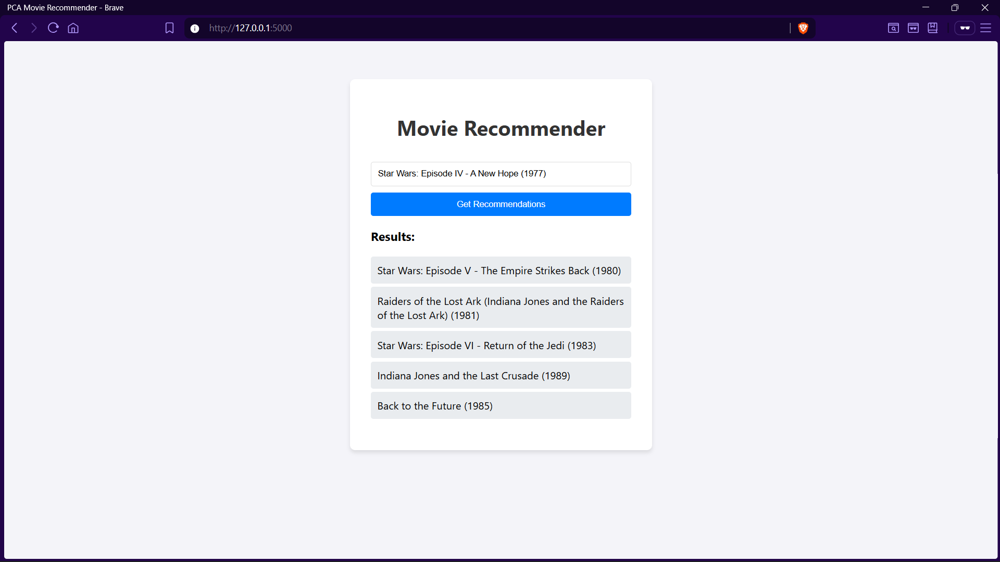

# Système de Recommandation de Films basé sur l'ACP (PCA)


Ce projet implémente un système de recommandation de films utilisant l'apprentissage automatique (Machine Learning) et une interface web Flask.  Le cœur du système repose sur l'Analyse en Composantes Principales (ACP/PCA).


## 📌 Fonctionnalités


* **Filtrage Collaboratif (Item-Based) :** Recommande des films similaires en se basant sur l'historique des notes des utilisateurs. 
* **Algorithme PCA :** Utilise `sklearn.decomposition.PCA` pour compresser la matrice de données clairsemée (sparse matrix).
* **Mesure de Similitude :** Utilise la similarité cosinus (Cosine Similarity) pour calculer la proximité entre les vecteurs de films.
* **Interface Web :** Application Flask simple et réactive pour interagir avec le modèle.  


## 🛠️ Architecture Technique


Le pipeline de données suit les étapes suivantes : 

1.  **Ingestion :** Chargement du dataset MovieLens (100k ratings).
2.  **Transformation :** Création d'une matrice pivot `Films x Utilisateurs`.
3.  **Réduction :** Application de l'ACP pour réduire le bruit et extraire les composants principaux.
4.  **Inférence :** Calcul des plus proches voisins via la similarité cosinus.  


## 📸 Aperçu du Projet (Screenshots)


### 1. Page d'Accueil


*L'interface utilisateur permettant de saisir un film.*


### 2. Résultats de Recommandation



*Les recommandations générées pour le film "Star Wars".*


---


## 🚀 Installation et Exécution


Ce projet a été développé sous Windows 11 avec Python 3.x. 


### 1. Cloner le dépôt

```bash

git clone https://github.com/zakaria-bouzouba/movie-recommender-pca.git
cd pca-movie-recs

```


### 2. Créer l'environnement virtuel

```powershell

python -m venv venv
.\venv\Scripts\Activate

```


### 3. Installer les dépendances

```bash

pip install -r requirements.txt

```


### 4. Télécharger les données

Le dataset n'est pas inclus dans le dépôt (trop volumineux). Exécutez ce script pour le télécharger automatiquement : 


```bash

python setup_data.py

```


### 5. Lancer l'application

```bash

python app.py

```

Accédez ensuite à http://127.0.0.1:5000 dans votre navigateur.


---


## 📂 Structure du Projet


```plaintext

pca_movie_recs/

├── app.py           # Point d'entrée de l'application Web Flask
├── recommender.py   # Logique PCA et calcul de similarité
├── setup_data.py    # Script d'automatisation de téléchargement des données
├── requirements.txt # Liste des dépendances Python
├── templates/       # Fichiers HTML
│   └── index.html
└── data/            # (Ignoré par Git) Dossier contenant les CSV MovieLens

```


---


## 🧠 Choix de l'Algorithme (PCA)


L'utilisation de l'ACP (PCA) permet de transformer la matrice de notations, qui est très creuse (beaucoup de zéros), en un espace dense de dimension inférieure.  Cela permet :  


* D'accélérer les calculs de similarité. 
* De capturer des corrélations implicites entre les films (ex: les films de science-fiction notés similairement par différents groupes d'utilisateurs).


---


## 👤 Auteur
**Zakaria BOUZOUBA**

Projet réalisé dans le cadre du module *Analyse des données multidimensionnelles*.

> Encadré par : **Prof. Raby GUERBAZ**
